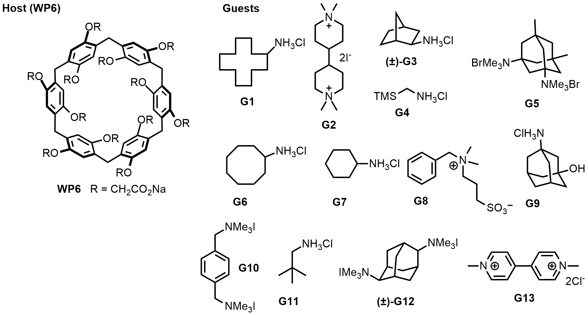

# The SAMPL9 WP6 challenge

The WP6 challenge focuses on binding of WP6 to thirteen ammonium/diammonium cationic guests. Experimental binding measurements have been collected and the Isaacs group is preparing a paper for publication.

Our deadline for this challenge will be posted in the top-level [README.md](https://github.com/samplchallenges/SAMPL9/blob/master/README.MD#the-wp6-challenge)

If you want any announcement of updates/changes/fixes here, [sign up for our e-mail list](http://eepurl.com/dPj11j)

## A quick view of the host and guests

Please be sure to read the Disclaimers section below to note points which may require particular attention

## More on the host

This host-guest series is based on a pillar[n]arene host known as WP6, yet to be featured in a previous SAMPL challenge. WP6 is similar to cucurbit[n]urils. Structurally, WP6 contains CH2 linkers connecting the phenylene groups, and each phenylene group contains two anionic functional group arms. Background information on WP6 may be found in a number of publications including DOIs: [10.1002/anie.202005902](https://onlinelibrary.wiley.com/doi/10.1002/anie.202005902), [10.1021/acs.chemrev.5b00765](https://pubs.acs.org/doi/abs/10.1021/acs.chemrev.5b00765), [10.1021/ja306399f](https://pubs.acs.org/doi/full/10.1021/ja306399f).

Per Lyle Isaacs, host WP6 itself has some dynamic stereochemistry associated with it.  The provided structures (originally a PDB) are for one enantiomeric conformation.  The OCH2CO2 groups can all pass "through the annulus" to give the other enantiomer.  So, the participants should be aware of the two enantiomers of host WP6 and for chiral guests G3 and G12 they should consider the different diastereomeric complexes.  However, the different diastereomeric complexes may not have different Ka values.

The provided host structure is given with 12 negatively charged groups; in reality, some may be protonated at pH 7.4; participants will need to deal with this complication. Isaacs' lab is working to obtain pKa values for these groups via pH-metric titration so it is possible this information may be available at some point, potentially after the challenge close.

## Experimental conditions

All ITC experiments were conducted in standard phosphate buffered saline (1x PBS solution containing 137 mM sodium chloride, 2.7 mM potassium chloride, and 10 mM phosphate buffer) at pH 7.40 and at 298.15 K. The concentration of WP6 used in the cell was between 50 uM and 1 mM, depending on the binding strength of the complex (where lower ka value would require a higher concentration of the host).

## Additional details on guests

Compounds G3 and G12 were tested as a racemic mixture of both enantiomers.

All complexes are 1:1 in this case.

There may possibly be some prior literature for some of these compounds binding to this host, but not in the same conditions (particularly, not in PBS). We encourage participants not to go hunting for any prior values (and if any are consulted, report them in your Methods section), and not to assume that present values ought to be similar to prior values.

## Disclaimers

Note that we have typically selected, or attempted to select, reasonable protonation states and conformers of the hosts and guests, but these may be controversial, uncertain, or change upon binding, so participants are encouraged to exercise care in selecting which states are modeled. Typically selection of protonation states, tautomers and conformers is one major place where particpant protocols differ and lead to different downstream results. In addition, guests G3 and G12 were used as racemic mixture.  

The WP6 host has some dynamic stereochemistry, with two potential enantiomers. WP6 has twelve carboxylate groups at the arms, and the passing of the carboxylate arms "through the annulus" gives a second enantiomer.

All host-guest complexes are 1:1 binders according to ITC.

## What's here:
- `host_files`: Files relating to the WP6 host; provides structure files for the host.
- `guest_files`: Files relating to the CB8 guests; provides structure files for the guests.
- `images`: Images used in this repo
- `source_files`: Raw source files as provided by the Isaacs group
- `WP6_submission.txt`: An example submission file for submitting to our system (please replace text and values with your own!). Filenames must begin with "WP6". See [host_guest_instructions.md](https://github.com/samplchallenges/SAMPL9/blob/master//host_guest_instructions.md) for submission instructions.  
