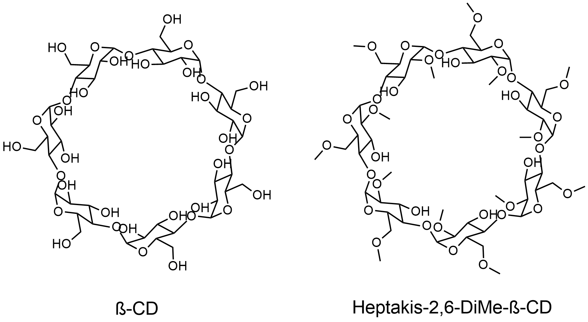
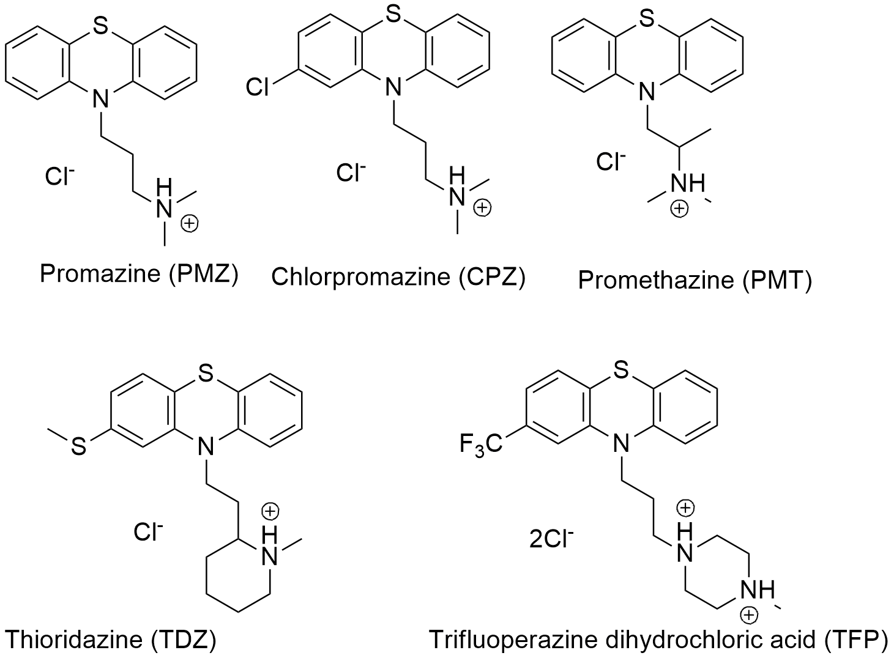

# The SAMPL9 bCD challenge

The bCD challenge focuses on binding of two hosts in the cyclodextrin family to five phenothiazine-based drugs. Experimental binding measurements have been collected and the Gilson group is preparing a paper for publication.

Our deadline for this challenge will be posted in the top-level [README.md](https://github.com/samplchallenges/SAMPL9/blob/main/README.md)

If you want any announcement of updates/changes/fixes here, [sign up for our e-mail list](http://eepurl.com/dPj11j)

## A quick view of the host and guests

The two hosts molecules are beta-cyclodextrin (bCD) and Hexakis-2,6-dimethyl-beta-cyclodextrin (H26DM-bCD).

The five guest phenothiazine-based drugs used for this challenge are Thioridazine hydrochloride (TDZ), Trifluoperazine dihydrochloride (TFP), Promazine hydrochloride (PMZ), Promethazine hydrochloride (PMT), and Chlorpromazine hydrochloride (CPZ). Shown below are the structures of the guest molecules used with the expected protonation state.

Please be sure to read the Disclaimers section below to note points which may require particular attention

## More on the host

Background information on bCD and guests may be found in a number of publications including DOIs: [10.1002/jps.21064](https://doi.org/10.1002/jps.21064 ), [10.1021/acs.jctc.7b00359](https://doi.org/10.1021/acs.jctc.7b00359), [10.26534/chemrxiv.12663065.v1](https://doi.org/10.26434/chemrxiv.12663065.v1).

## Experimental conditions

All ITC results have been collected in triplicate on an ITC200 in phosphate buffer (sodium counterion, no potassium), pH 7.4, 25mM at 25 C with a 20-point binding isotherm (1-1.5 uL injections). Enthalpograms will be provided for each complex. In each case the guest was in the cell and the host in the syringe. Concentration of solutions varied for each complex depdning on binding affinity.

## Disclaimers

Note that we have typically selected, or attempted to select, reasonable protonation states and conformers of the hosts and guests, but these may be controversial, uncertain, or change upon binding, so participants are encouraged to exercise care in selecting which states are modeled. Typically selection of protonation states, tautomers and conformers is one major place where particpant protocols differ and lead to different downstream results.  

## What's here:
- `host_files`: Files relating to the bCD hosts; provides structure files for the host.
- `guest_files`: Files relating to the bCD guests; provides structure files for the guests.
- `images`: Images used in this repo
- `source_files`: Raw source files as provided by the Gilson group
- `CD_submission.txt`: An example submission file for submitting to our system (please replace text and values with your own!). Filenames must begin with "CD". See [host_guest_instructions.md](https://github.com/samplchallenges/SAMPL9/blob/master//host_guest_instructions.md) for submission instructions.  
