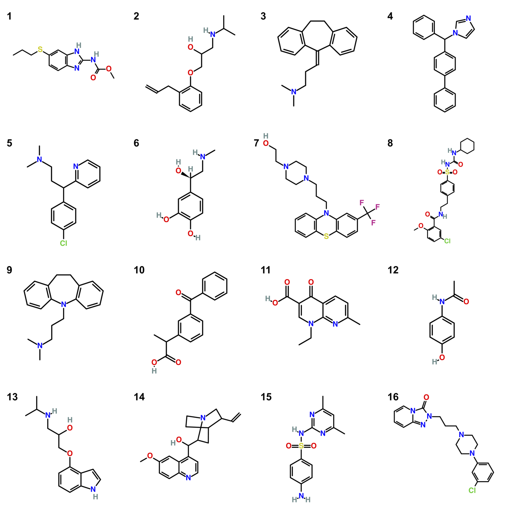

# The SAMPL9 LogP Challenge

The SAMPL9 logP challenge begins immediately and runs through Friday, Jan. 27 at 13:00 UTC. The compound list is provided here, and submission details and instructions (including data format) will be posted soon.

## Experimental details

For experimental measurements, we are indebted to Dr. Clara Ràfols (University of Barcelona), Dr. Rebeca Ruiz (Pion, UK) and William Zamora (University of Costa Rica), who measured the values used here and who are delaying publication of their experimental work to allow this challenge to proceed.

Experimental measurements were done for sixteen compounds with acid-base properties (see Table 1), most of them drugs showing a variety of therapeutical capabilities. These were commonly selected from Sigma-Aldrich ≥ 98% (www.sigmaaldrich.com), with some selected because of potential internal hydrogen bonding. The partition solvent was from Sigma-Aldrich: toluene (ACS reagent, ≥ 99.5%, 179418).

**Table 1. Experimental equipment used in the determination of logPtol/w**
|**name**	| **Exp. equipment** |
|-----------|--------------|
| Albendazole	| Pion SiriusT3 |
| Alprenolol	| Pion SiriusT3 |
| Amitriptyline	| Sirius D-PAS & GLpKa |
| Bifonazole	| Pion SiriusT3 |
| Chlorpheniramine maleate salt	| Sirius D-PAS & GLpKa |
| Epinephrine	| Pion SiriusT3 |
| Fluphenazine dihydrochloride	| Sirius D-PAS & GLpKa |
| Glyburide	| Pion SiriusT3 |
| Imipramine hydrochloride	| Sirius D-PAS & GLpKa |
| Ketoprofen	| Pion SiriusT3 |
| Nalidixic acid	| Sirius D-PAS & GLpKa |
| Paracetamol	| Pion SiriusT3 |
| Pindolol	| Pion SiriusT3 |
| Quinine	Sirius | D-PAS & GLpKa |
| Sulfamethazine	| Sirius D-PAS & GLpKa |
| Trazodone hydrochloride	| Pion SiriusT3 |

Partition values, log Ptol/w, were obtained by sample titrations as typically described for aqueous pKa determination but in presence of various amounts of the partitioning solvent. The log Psolv/w was calculated by the difference between the aqueous pKa and the apparent poKa (pKa measured in presence of a partition solvent) at several phase ratios depending on the expected partition value. All measurements were taken at 25 °C, under an inert gas atmosphere, and at least three titrations were made for each compound (Avdeef, 1993; Avdeef, Comer et al. 1993). Several titrations were carried out at the measurement limit conditions of the potentiometric technique. In these instances, the cautions for log Poct/w determination previously described were considered (Ràfols et al., 2012).

**References**:
- Avdeef, A., Comer J., 1993. pH-Metric log P.II. Refinement of partition coeficients and ionization constants of multiprotic substances, J. Pharm. Sci. 82, 183-190
- Avdeef, Alex; Comer, John E. A.; Thomson, Simon J., 1993. pH-Metric log P. 3. Glass electrode calibration in methanol-water, applied to pKa determination of water-insoluble substances, Anal. Chem., 65, 42-49
- Ràfols, C., Bosch, E., Ruiz, R., Box, K. J., Reis, M., Ventura, C., Santos, S., Araújo, M. E., Martins F., 2012. Acidity and Hydrophobicity of Several New Potential Antitubercular Drugs: Isoniazid and Benzimidazole Derivatives, J. Chem. Eng. Data, 57, 330-338

## Manifest

- `compounds.csv`: A list of the compounds to be considered in the challenge
- `compounds_image.png`: An image of the compounds
- `logP_prediction_template.csv`: Template file for predictions
- `logP_template_example.csv`: Example completed template for submission
