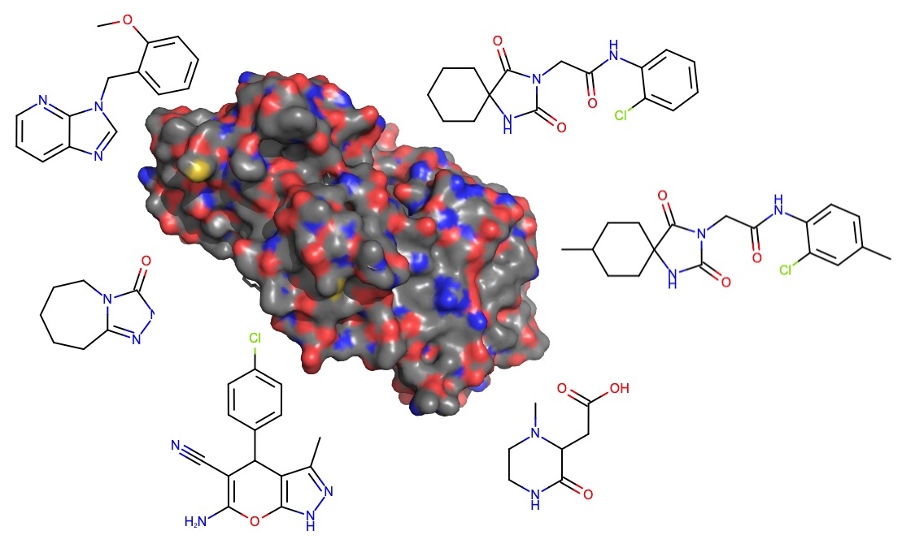

# The SAMPL9 NanoLuc Challenge

This contains information on the SAMPL9 Nanoluciferase (NanoLuc) binding challenge, as well as setting the stage for a second portion of this challenge in SAMPL10.

The SAMPL9 NanoLuc challenge involves predicting (in Phase 1) whether a series of compounds bind to nanoluciferase, as described below. Phase 2 involves predicting IC50 values for those which bind. The SAMPL10 NanoLuc challenge is identical, but involves a different compound set (provided as Tranche 2 here).

## Credits

We gratefully acknowledge the NCATS staff for conducting the experiments and providing this dataset for SAMPL, and we are especially thankful for the work of:
- Min Shen
- Dorian Cheff
- Matt Hall

## Challenge description:

A luciferase reporter assay is widely used to quantitatively assess gene expression level changes in response to pharmacological manipulation. In addition, bioluminescent resonant energy transfer (BRET) assays utilizing luciferases have recently become popular for assaying modulators of protein-protein interactions. For the observed emission differences to be attributed to changes in expression levels or target association, direct modulation of luciferase activity by the compound of interest must be ruled out, generally requiring compound libraries to be counterscreened against the luciferase enzyme in advance.

Recently, optimized versions of luciferase enzymes have been produced that generate higher brightness readouts (using modified substrates). NanoLuc (from Oplophorus gracilirostris, a luminous shrimp) is one such luciferase, which is also much smaller (19 kDa, compared to the 61 kDa firefly luciferase). Its small size, high stability, and relatively uncomplicated binding site make it an ideal model system for assessing computational approaches to predicting small molecule binding. Available crystal structure of NanoLuc (PDBID: 5IBO and others) make testing structure-based affinity prediction methods possible.

NCATS used standard assays (see “Experimental details”, below) to measure binding of large compound libraries to NanoLuc, in particular via inhibition of enzymatic activity.

Initial results at NCATS: 91K compounds screened. Hit rate was in the single-digit percentage range, and more than 100 compounds were confirmed with IC50 < 20uM in follow-up qHTS assays (done roughly as described in [10.1073/pnas.0604348103](https://dx.doi.org/10.1073/pnas.0604348103)). In structure this is relatively similar to [pubchem.ncbi.nlm.nih.gov/bioassay/1347043](http://pubchem.ncbi.nlm.nih.gov/bioassay/1347043), a dataset generated by similar means on similar (and some of the same) compounds but examining binding to firefly luciferase.  

Assays are based on inhibition of luminescence, so that should be factored into any binding predictions – any compound which inhibits luminescence while binding will show activity; any which does not will be an inactive. The organizers make no warranty as to location or identity of any relevant binding site(s).

Here we are breaking the overall dataset into two tranches, forming the basis for two challenges (one, here, for SAMPL9, and the other for SAMPL10), in order to facilitate community learning. It is anticipated that participants will learn a great deal from the results of the first challenge, allowing them to perform better in a second challenge on a highly related dataset.

If you are interested in participating, please sign up for our [SAMPL9 e-mail list](http://eepurl.com/dPj11j) (be sure to indicate an interest in SAMPL9 AND protein-ligand challenges) AND watch this GitHub repository so you are notified of changes and updates.

## Challenge staging

- Step 1: Predict which compounds from the overall library inhibit the nanoLuc luminescence signal and which do not inhibit (with a detection threshold of roughly 200 micromolar); at this stage we will release only compound IDs and SMILES/structures and predictions must provide predicted inhibitor/non-inhibitor status for all compound IDs.
- Step 2: For those which bind, predict IC50 values. At this stage we will release results of Stage 1 and participants must predict IC50 values for all binders. This will be broken into two sub-categories: Ranking and affinity prediction.

These two stages will apply for SAMPL9 and for SAMPL10. The corresponding compound tranches are now available in this repository.

### Timing

Stage 1 challenge inputs are now available as SMILES, as of 2022-05-10. Conformers are available as of June 30.

- Stage 1 predictions are due Friday, September 23, 2022, at midnight UTC.
- Stage 2 inputs will be released on or about Sept. 26, 2022.
- Stage 2 predictions are due Friday, Dec. 9, 2022, at midnight UTC.

### Prediction formats

The Stage 1 (virtual screening) submission format requires submission of a prediction for whether each compound in tranche1 does/does not inhibit the nanoLuc luminescence signal (with a detection threshold of roughly 200 micromolar). Submissions must follow this format and be uploaded to the required submission server (link to be provided when available). Predictions are required for every compound; any missing compounds will be assumed to be predicted to be `false` (but you should submit for every compound). If your method is not able to make a prediction for a given compound, you must fill in a default value of your choice. (Given the hit rate in the library it is probably preferable to fill in `false`). This format is available as `NANOLUC_stage1_submission_template.txt`. Any example values provided in this template are given purely for illustration purposes.

The Stage 2 (IC50 prediction) portion of the challenge requires predicting an IC50 value (with uncertainty) for all of the compounds in the set for which IC50s were measured. This list will be made available once Stage 1 closes. The submission format is available as `NANOLUC_stage2_submission_template.txt` and any example values provided in this template are given purely for illustration purposes. Predicted values and their uncertainties (both in micromolar) must be provided for all Stage 2 compounds.

### Submission instructions

To submit, upload your completed submission file to the appropriate SAMPL9 submission server (below) by the requisite deadline. You MUST follow the required submission format for your challenge stage, and your file name must begin with "NANOLUC". Additional details are available as comments within the template file itself.
- Submit [SAMPL9 virtual screening submissions here](https://submit.samplchallenges.org/submit/SAMPL9-VS)

Please note that the server will do some basic error checking, such as checking that it can read at least SOME data from your predictions section, checking that the requisite fields are completed, etc. However, it will NOT check whether you have submitted predictions for all compounds; it will simply check that it can process predictions for at least some compounds.

## Containerized challenges

We are also beta testing infrastructure to run containerized challenges, where participants upload methods rather than predictions (and we run the methods). If you are interested in participating in one of these, please reach out to David Mobley and copy Meghan Osato (emails dmobley and osatom, both at UCI.edu) for details. Infrastructure for this is expected to be ready in June and details will be linked or posted here.

## Experimental details:
Secreted Nano Luciferase was collected after 24 hours from confluent S16 PMP22 secNLuc-P2-A-GFP Rat Schwann Cells (cultured in DMEM High Glucose –Phenol Red media + 1% FBS + 1% P/S) in a T225 flask at 37°C. Spent media was strained through a 40 um Corning cell strainer and diluted 1:10 in culture media. DMEM media at culture conditions maintains a pH of approximately 7.5. 2 µL of the Enzyme/media solution was dispensed into each well of a white, solid bottom 1536-well plate using a BioRaptr Flying Reagent Dispenser. 23 nL of library compounds at various concentrations were then transferred into each well using a Kalypsys pin-tool. Following a 10-minute covered incubation at room temperature, 2 µL of Nano-Glo luciferase reagent (Promega) was dispensed into each well using a BioRaptr. Following a 10 minute incubation at room temperature, luminescence was measured on a Viewlux luminometer (1s exposure, slow speed, high gain, 2x2 binning). UniProt Q9GV45 (LUCI_OPLGR); Protein = Oplophorus-luciferin 2-monooxygenase catalytic subunit; Organism = Oplophorus gracilirostris (Luminous shrimp).

The dose-response data for each sample was plotted and modeled by a four-parameter logistic fit yielding IC50 and efficacy (maximal response) values using NCATS in-house informatics software. In cases where compounds were inactive, no IC50 value is listed/determined. For those with dose response curves, provided data include qHTS curve classifications, curve descriptions, IC50 values, maximal response.

## Manifest
- `NCATS_experimental_data`: Directory containing source/challenge data from NCATS. See additional [README.md](NCATS_experimental_data/README.md) for contents.
- `NANOLUC_stage1_submission_template.txt`: Submission template for stage 1, virtual screening
- `NANOLUC_stage2_submission_template.txt`: Submission template for stage 2, IC50 prediction.
